# Amazon_Vine_Analysis

## Overview of the analysis

Since my work with Jennifer on the SellBy project was so successful, I’ve been tasked with another, larger project: analyzing Amazon reviews written by members of the paid Amazon Vine program. The Amazon Vine program is a service that allows manufacturers and publishers to receive reviews for their products. Companies like SellBy pay a small fee to Amazon and provide products to Amazon Vine members, who are then required to publish a review.

In this project, I had access to approximately 50 datasets. Each one contains reviews of a specific product, from clothing apparel to wireless products. I  picked one of these datasets and used PySpark to perform the ETL process to extract the dataset, transform the data, connect to an AWS RDS instance, and load the transformed data into pgAdmin. Next, I used SQL to determine if there is any bias toward favorable reviews from Vine members in my dataset. 

### Dataset :https://s3.amazonaws.com/amazon-reviews-pds/tsv/amazon_reviews_us_Software_v1_00.tsv.gz

## Results

- How many Vine reviews and non-Vine reviews were there?
 
  - created a new table to rereive all the rows where the total_votes count is equal to or greater than 20 to pick reviews that are more likely to be helpful and to avoid having division by zero errors later on.

    

   - Filtered the new table created in above step to create table to retreive all the rows where the number of helpful_votes divided by total_votes is equal to or greater than 50%.

     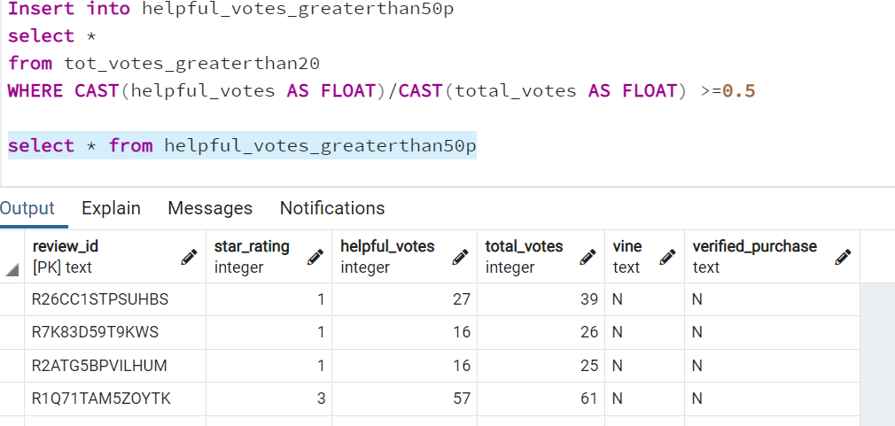

   - Filtered the newly created table that retreives all the rows where a review written as part of the Vine program(paid),vine == Y

     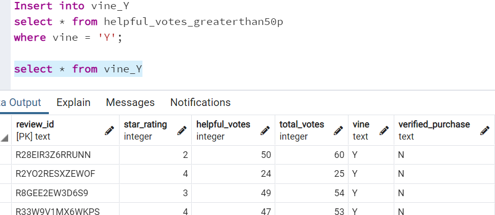

   - Repeated the above step  but this time retreive all the rows where the review was not part of the Vine program(paid), vine == N

     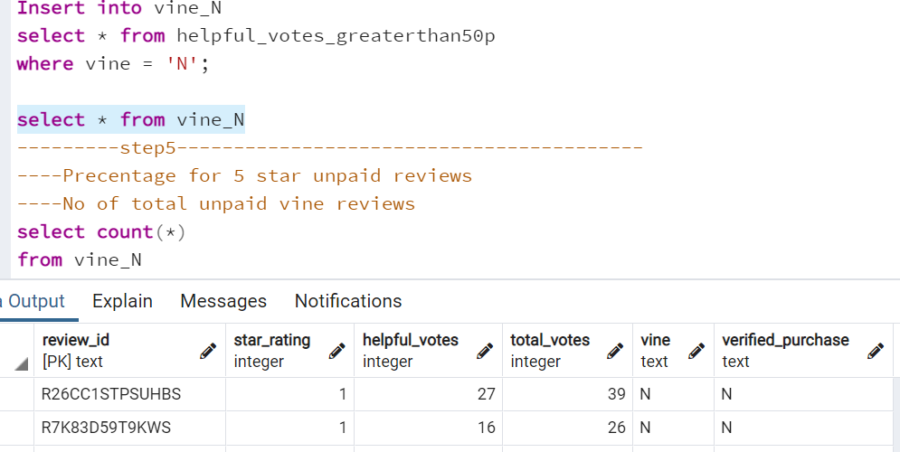
     

- How many Vine reviews were 5 stars? How many non-Vine reviews were 5 stars?

  - Vine 5 star reviews

   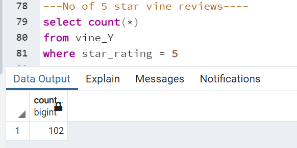
   

  - Non-Vine 5 star reviews

  
   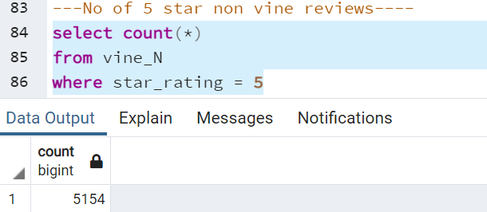

- What percentage of Vine reviews were 5 stars? What percentage of non-Vine reviews were 5 stars?

 

  - precentage of vine reviews with 5 stars

    -  filtered the Vine 5 star reviews and inserted in to table vine_Y_fivestar

         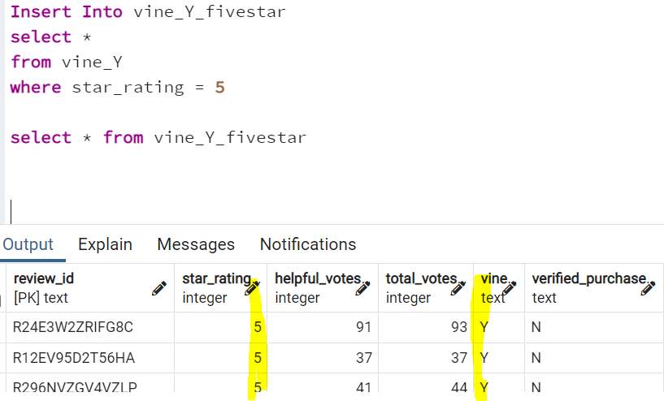

     
    - Using WITH function calculated precentage of vine reviews with 5 star 

        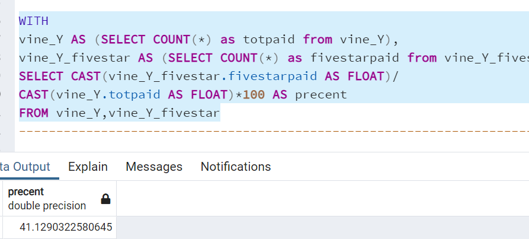

  - precentage of non-vine reviews with 5 star

     - filtered the Vine 5 star reviews and inserted in to table vine_N_fivestar

       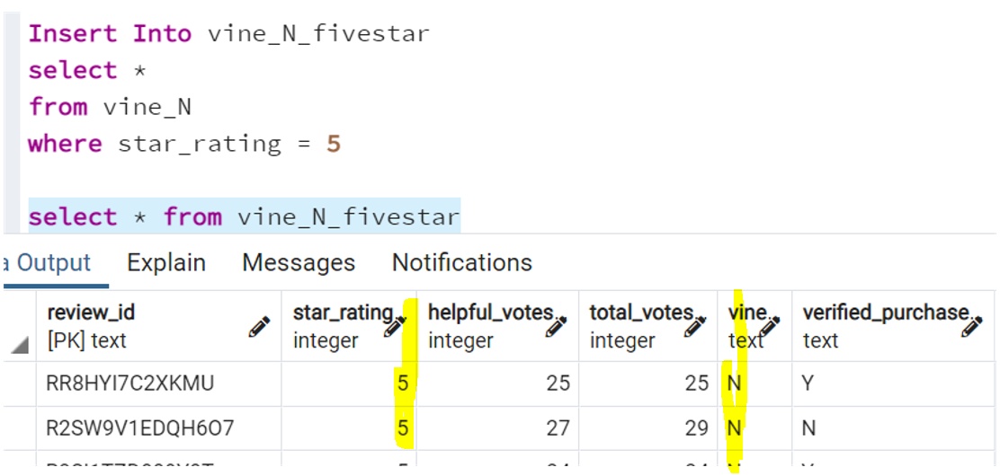

    - Using WITH function calculated precentage of non-vine reviews with 5 star

       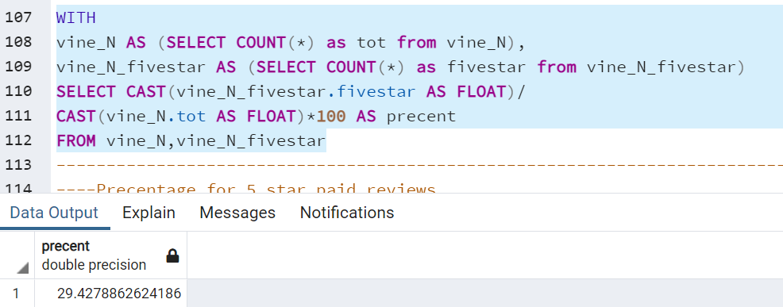

## Summary

Above summery gives results ,precentage of vine reviews with 5 stars is 41.12
% and precentage of non vine reviews with 5 star is 29.47%.
So we can clearly say  there is any positivity bias for reviews in the Vine program. 

 Additional analysis to support above  statement:

- Calculated the precentages for non-vine amd vine reviews with three stars

   - Precentage of vine reviews with 3 star

    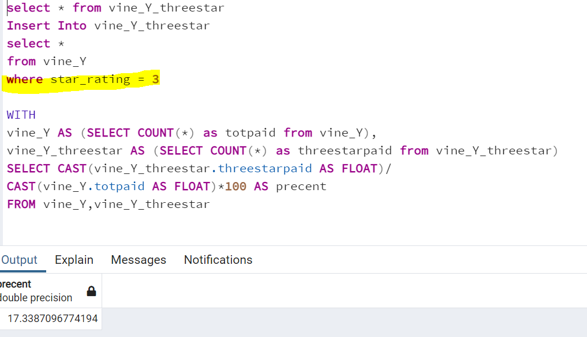

  - Precentage of non-vine reviews with 3 star

    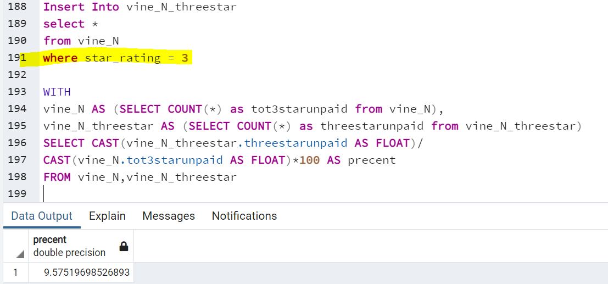
 
 So the Three stars vine reiviews has highest presentage(17.39%) than three star non vine reiviewa with presentage (9.57%),which supports the statement there is any positivity bias for reviews in the Vine program. 

  
